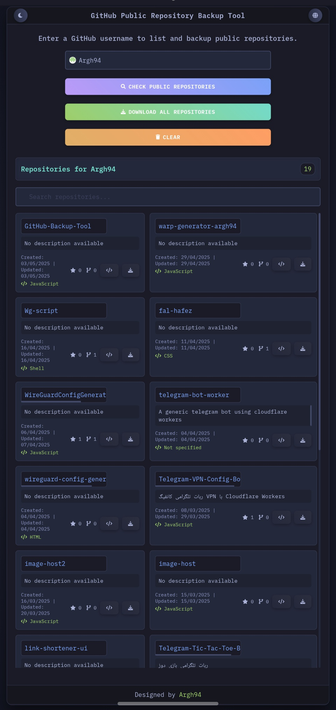
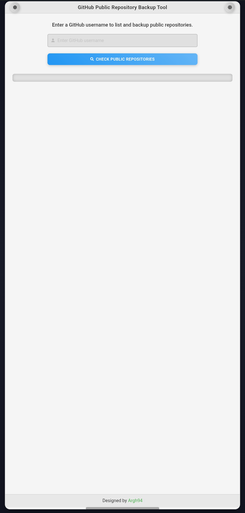

# GitHub Public Repository Backup Tool


A simple and elegant web tool to list and backup public GitHub repositories as ZIP files. Built with HTML, CSS, and JavaScript, this project uses the GitHub API and a custom Cloudflare Worker to enable seamless repository downloads.

---

## ✨ Features

- **List Public Repositories**: Enter a GitHub username to view all public repositories with details like description, creation date, and language.
- **Backup Repositories**: Download individual repositories or all repositories as ZIP files in one go.
- **Search Functionality**: Filter repositories by name, description, or language.
- **Dark/Light Theme**: Toggle between dark and light themes for a better user experience.
- **Multilingual Support**: Switch between English and Persian (Farsi) interfaces.
- **Responsive Design**: Works smoothly on desktop and mobile devices.
- **CORS Handling**: Uses a Cloudflare Worker to bypass CORS restrictions for direct ZIP downloads.

---

## 📸 Screenshots

| Dark Theme | Light Theme |
|------------|-------------|
|  |  |

---

## 🚀 Demo

Try the tool live at: [https://Argh94.github.io/GitHub-Backup-Tool/](https://Argh94.github.io/GitHub-Backup-Tool/)

---

---

## 📖 Usage

1. Open the tool in your browser (via GitHub Pages or locally).
2. Enter a GitHub username in the input field.
3. Click **Check Public Repositories** to list all public repositories.
4. Use the search bar to filter repositories.
5. Click **Download All Repositories** to download all repositories as a single ZIP file, or download individual repositories using the download button next to each.

---

## 🔧 Technologies Used

- **HTML5**: For the structure of the web page.
- **CSS3**: For styling, including dark/light themes and responsive design.
- **JavaScript**: For interacting with the GitHub API and handling downloads.
- **GitHub API**: To fetch public repository data.
- **Cloudflare Workers**: To proxy ZIP downloads and bypass CORS restrictions.
- **Font Awesome**: For icons.
- **Google Fonts**: For `Vazir` (Persian) and `Roboto`/`IBM Plex Mono` (English) fonts.

---

## ⚙️ Configuration

To customize the tool:

1. **Change Worker URL**:
   - Update the `WORKER_URL` in `js/download.js` to point to your Cloudflare Worker.
   - Example:
     ```javascript
     const WORKER_URL = "https://git-zip.tahmasebimoein140.workers.dev/";
     ```

2. **Modify Styles**:
   - Edit `css/style.css` to change colors, fonts, or layouts.

3. **Add Translations**:
   - Update `js/lang.js` to add support for additional languages.

---

## 🤝 Contributing

Contributions are welcome! To contribute:

1. Fork the repository.
2. Create a new branch (`git checkout -b feature/your-feature`).
3. Make your changes and commit (`git commit -m "Add your feature"`).
4. Push to the branch (`git push origin feature/your-feature`).
5. Open a Pull Request.

Please follow the [Code of Conduct](CODE_OF_CONDUCT.md).

---

## 📜 License

This project is licensed under the [MIT License](LICENSE).

---

## 🙏 Acknowledgments

- [GitHub API](https://docs.github.com/en/rest) for providing repository data.
- [Cloudflare Workers](https://workers.cloudflare.com/) for enabling seamless downloads.
- [Font Awesome](https://fontawesome.com/) for icons.
- [Google Fonts](https://fonts.google.com/) for typography.
- 
