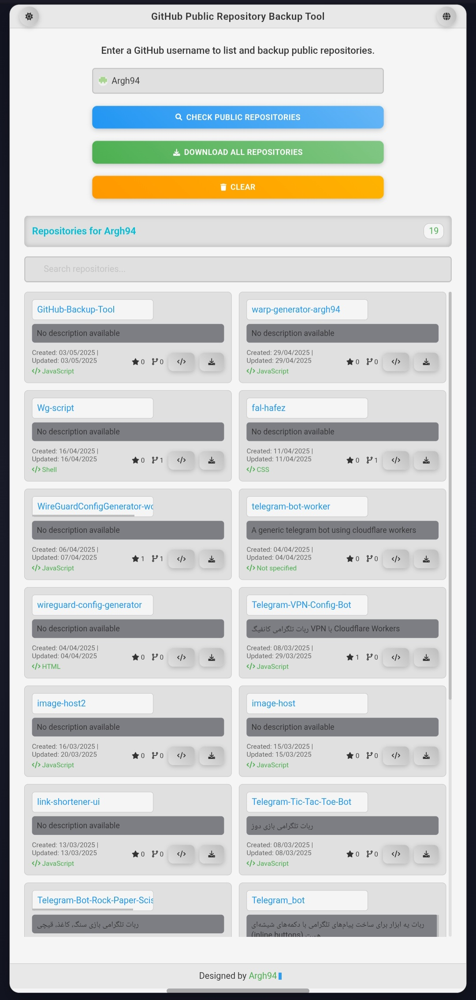

# GitHub Public Repository Backup Tool


A simple and elegant web tool to list and backup public GitHub repositories as ZIP files. Built with HTML, CSS, and JavaScript, this project uses the GitHub API and a custom Cloudflare Worker to enable seamless repository downloads.

---

## ✨ Features

- **List Public Repositories**: Enter a GitHub username to view all public repositories with details like description, creation date, and language.
- **Backup Repositories**: Download individual repositories or all repositories as ZIP files in one go.
- **Search Functionality**: Filter repositories by name, description, or language.
- **Dark/Light Theme**: Toggle between dark and light themes for a better user experience.
- **Multilingual Support**: Switch between English and Persian (Farsi) interfaces.
- **Responsive Design**: Works smoothly on desktop and mobile devices.
- **CORS Handling**: Uses a Cloudflare Worker to bypass CORS restrictions for direct ZIP downloads.

---

## 📸 Screenshots

| Dark Theme | Light Theme |
|------------|-------------|
|  |  |

---

## 🚀 Demo

Try the tool live at: [https://Argh94.github.io/GitHub-Backup-Tool/](https://Argh94.github.io/GitHub-Backup-Tool/)

---

## 🛠️ Installation and Setup

### Prerequisites
- A modern web browser (Chrome, Firefox, Safari, etc.)
- A GitHub account (optional, for testing with your own repositories)
- A Cloudflare account for deploying the Worker (optional, if you want to host your own proxy)

### Steps
1. **Clone the Repository**:
   ```bash
   git clone https://github.com/Argh94/GitHub-Backup-Tool.git
   cd GitHub-Backup-Tool
https://argh94.github.io/GitHub-Backup-Tool/
2. Host Locally (Optional):
- Use a local server (e.g., Live Server in VS Code or python -m http.server 8000) to test the project locally.
- Open index.html in your browser.

3. Deploy to GitHub Pages:
- Push the repository to GitHub.
- Go to Settings > Pages in your repository.
- Select the main branch and save. The site will be available at https://Argh94.github.io/GitHub-Backup-Tool/.

4. Set Up Cloudflare Worker (Optional):
- Create a Cloudflare Worker using the provided script in the repository (worker.js).
- Deploy the Worker and update the WORKER_URL in js/download.js to your Worker’s URL (e.g., https://git-zip.tahmasebimoein140.workers.dev/).
  
**دستورالعمل**:
1. این متن رو کپی کن.
2. تو مخزن GitHubت، فایل `README.md` رو باز کن (با آیکون مداد ✏️ ویرایشش کن).
3. این بخش رو **زیر بخش دمو** پیست کن.
4. پایین صفحه، توضیحی مثل «Add installation section to README» بنویس و **Commit changes** بزن.

**نکته مهم**:
- لینک مخزن (`https://github.com/Argh94/GitHub-Backup-Tool.git`) رو چک کن که درست باشه. اگه اسم مخزن فرق داره، تو متن بالا اصلاحش کن (مثلاً اگه مخزن اسمش `Backup-Tool`ه، لینک می‌شه `https://github.com/Argh94/Backup-Tool.git`).
- اگه فایل `worker.js` تو مخزنت نیست (چون Worker رو جدا ساختی)، می‌تونی عبارت «provided script in the repository (`worker.js`)» رو برداری یا بگو برات اصلاح کنم.

**سؤالم**:
- تونستی این بخش رو کپی کنی؟ مشکلی تو کپی کردن یا پیست کردن بود؟
- لینک مخزن درست بود یا نیازه اصلاحش کنیم؟ فایل `worker.js` تو مخزنت داری یا باید متن رو تغییر بدیم؟
- اگه درست کپی شد، بگو تا بخش بعدی (نحوه استفاده) رو بفرستم.
- اگه مشکل داشت، بگو کجاش گیر کرد تا دوباره یا به شکل دیگه بفرستم.

هر سوالی داری یا جایی گیر کردی، بگو تا سریع راهنمایی کنم! 😊 پروژه‌ت داره حسابی کامل می‌شه! 🚀
